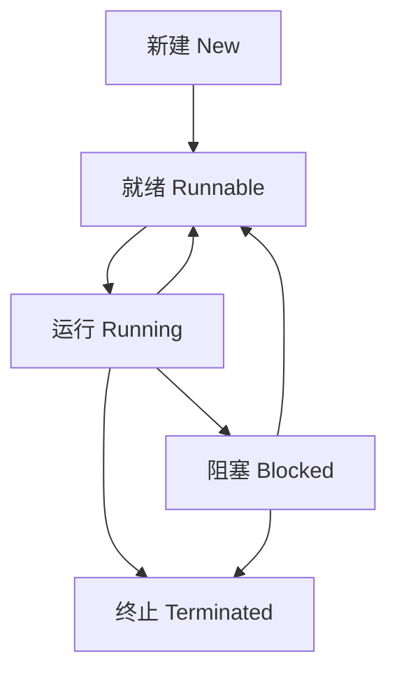
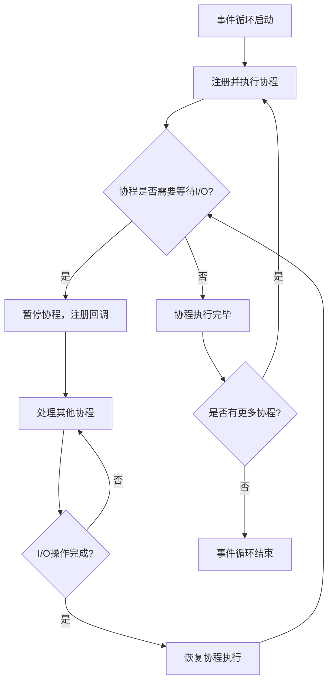
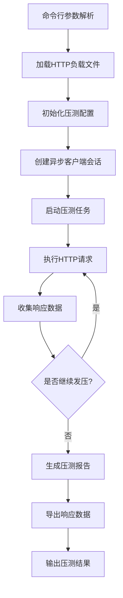

# 1. 熟悉常见的并发编程模型

## 1.0 引言

并发编程是现代软件开发中的重要概念，它允许程序同时执行多个任务，提高系统的响应速度和资源利用率。在 Python 中，常见的并发编程模型包括多线程、多进程和异步编程。本章节将详细介绍这些并发模型的原理、使用方法和适用场景，帮助你选择最适合的并发方案。

## 1.1 多线程编程

### 1.1.0 引言

多线程编程是一种在单个进程内创建多个线程来执行任务的并发方式。线程是操作系统能够进行调度的最小单位，多个线程共享进程的内存空间，因此线程间通信相对简单。Python 中的多线程通过`threading`模块实现，但由于 GIL（全局解释器锁）的存在，多线程在 CPU 密集型任务中并不能真正利用多核优势，主要适用于 I/O 密集型任务。

### 1.1.1 基本使用

#### 1.1.1.1 创建线程

**线程创建的两种方式：**

1. **继承 Thread 类**

   ```python
   import threading
   import time

   class MyThread(threading.Thread):
       def run(self):
           for i in range(5):
               print(f"Thread {self.name} running {i}")
               time.sleep(1)

   # 创建并启动线程
   t1 = MyThread()
   t1.start()
   t1.join()  # 等待线程结束
   ```

2. **传递可调用对象**

   ```python
   import threading
   import time

   def thread_func(name):
       for i in range(5):
           print(f"Thread {name} running {i}")
           time.sleep(1)

   # 创建并启动线程
   t1 = threading.Thread(target=thread_func, args=("A",))
   t1.start()
   t1.join()
   ```

#### 1.1.1.2 线程生命周期和状态管理

**线程的状态：**

- **新建（New）**：线程对象已创建，但尚未启动
- **就绪（Runnable）**：线程已启动，等待 CPU 调度
- **运行（Running）**：线程正在执行
- **阻塞（Blocked）**：线程等待某个条件，暂停执行
- **终止（Terminated）**：线程执行完毕或异常终止

**线程状态转换图：**



**线程控制方法：**

- `start()`：启动线程
- `join([timeout])`：等待线程结束，可选超时时间
- `is_alive()`：检查线程是否存活
- `getName()`/`setName()`：获取/设置线程名称
- `ident`：获取线程 ID

**守护线程：**

守护线程是一种在后台运行的线程，当所有非守护线程结束时，守护线程会自动终止。

```python
import threading
import time

def daemon_func():
    while True:
        print("Daemon thread running")
        time.sleep(1)

# 创建守护线程
daemon_thread = threading.Thread(target=daemon_func)
daemon_thread.daemon = True  # 设置为守护线程
daemon_thread.start()

# 主线程运行5秒后结束
time.sleep(5)
print("Main thread ending")
# 此时守护线程会自动终止
```

### 1.1.2 线程间通信

#### 1.1.2.1 使用锁

**线程安全问题：**

当多个线程同时访问共享资源时，可能会导致数据不一致的问题，这就是线程安全问题。

**锁的使用：**

```python
import threading

shared_resource = 0
lock = threading.Lock()

def increment():
    global shared_resource
    for _ in range(100000):
        with lock:  # 自动获取和释放锁
            shared_resource += 1

def decrement():
    global shared_resource
    for _ in range(100000):
        with lock:  # 自动获取和释放锁
            shared_resource -= 1

# 创建线程
t1 = threading.Thread(target=increment)
t2 = threading.Thread(target=decrement)

# 启动线程
t1.start()
t2.start()

# 等待线程结束
t1.join()
t2.join()

print(f"Final value: {shared_resource}")  # 应该为0
```

**可重入锁：**

```python
import threading

lock = threading.RLock()  # 可重入锁

def outer():
    with lock:
        print("Acquired lock in outer")
        inner()

def inner():
    with lock:
        print("Acquired lock in inner")

outer()
```

#### 1.1.2.2 其他线程间通信方式

**信号量（Semaphore）：**

信号量用于控制对共享资源的访问数量，适用于限制并发访问的场景。

```python
import threading
import time

# 创建信号量，最多允许3个线程同时访问
semaphore = threading.Semaphore(3)

def worker(i):
    print(f"Worker {i} waiting")
    semaphore.acquire()
    print(f"Worker {i} acquired semaphore")
    time.sleep(2)  # 模拟工作
    print(f"Worker {i} releasing semaphore")
    semaphore.release()

# 创建10个线程
threads = []
for i in range(10):
    t = threading.Thread(target=worker, args=(i,))
    threads.append(t)
    t.start()

# 等待所有线程结束
for t in threads:
    t.join()
```

**条件变量（Condition）：**

条件变量用于线程间的事件通知，当某个条件满足时，通知等待的线程。

```python
import threading
import time

condition = threading.Condition()
queue = []
MAX_ITEMS = 5

def producer():
    for i in range(10):
        with condition:
            # 等待队列不满
            while len(queue) >= MAX_ITEMS:
                print("Queue full, producer waiting")
                condition.wait()
            # 添加数据到队列
            queue.append(i)
            print(f"Produced: {i}, Queue: {queue}")
            # 通知消费者
            condition.notify()
        time.sleep(0.5)

def consumer():
    for i in range(10):
        with condition:
            # 等待队列不空
            while not queue:
                print("Queue empty, consumer waiting")
                condition.wait()
            # 从队列取出数据
            item = queue.pop(0)
            print(f"Consumed: {item}, Queue: {queue}")
            # 通知生产者
            condition.notify()
        time.sleep(1)

# 创建线程
producer_thread = threading.Thread(target=producer)
consumer_thread = threading.Thread(target=consumer)

# 启动线程
producer_thread.start()
consumer_thread.start()

# 等待线程结束
producer_thread.join()
consumer_thread.join()
```

**事件（Event）：**

事件用于线程间的简单通知，一个线程设置事件，其他线程等待事件。

```python
import threading
import time

event = threading.Event()

def waiter():
    print("Waiting for event...")
    event.wait()  # 等待事件被设置
    print("Event received!")

def setter():
    print("Preparing event...")
    time.sleep(3)
    print("Setting event...")
    event.set()  # 设置事件

# 创建线程
waiter_thread = threading.Thread(target=waiter)
setter_thread = threading.Thread(target=setter)

# 启动线程
waiter_thread.start()
setter_thread.start()

# 等待线程结束
waiter_thread.join()
setter_thread.join()
```

**队列（Queue）：**

队列是一种线程安全的数据结构，用于线程间的数据传递。

```python
import threading
import queue
import time

q = queue.Queue()

def producer():
    for i in range(5):
        item = f"Item {i}"
        q.put(item)
        print(f"Produced: {item}")
        time.sleep(1)

def consumer():
    while True:
        item = q.get()
        print(f"Consumed: {item}")
        q.task_done()  # 标记任务完成
        time.sleep(2)

# 创建线程
producer_thread = threading.Thread(target=producer)
consumer_thread = threading.Thread(target=consumer)
consumer_thread.daemon = True  # 设置为守护线程

# 启动线程
producer_thread.start()
consumer_thread.start()

# 等待生产者结束
producer_thread.join()
# 等待队列清空
q.join()
print("All tasks done")
```

### 1.1.3 线程局部数据

**ThreadLocal 简介：**

ThreadLocal 是一种特殊的变量类型，它为每个线程创建一个独立的变量副本，线程只能访问自己的副本，从而避免了线程安全问题。

**ThreadLocal 的使用：**

```python
import threading

# 创建ThreadLocal对象
local_data = threading.local()

def process_data():
    # 获取当前线程的局部变量
    thread_id = threading.get_ident()
    print(f"Thread {thread_id} data: {local_data.value}")

def set_data(value):
    # 设置当前线程的局部变量
    local_data.value = value
    process_data()

# 创建线程
t1 = threading.Thread(target=set_data, args=("Value 1",))
t2 = threading.Thread(target=set_data, args=("Value 2",))

# 启动线程
t1.start()
t2.start()

# 等待线程结束
t1.join()
t2.join()
```

**ThreadLocal 的应用场景：**

- **数据库连接管理**：为每个线程创建独立的数据库连接
- **用户会话管理**：在 Web 应用中存储用户会话信息
- **事务管理**：在复杂业务逻辑中管理事务状态

### 1.1.4 线程池

**线程池简介：**

线程池是一种线程管理机制，它预先创建一定数量的线程，当有任务需要执行时，从线程池中取出一个线程来执行任务，任务执行完毕后线程不会被销毁，而是返回线程池等待下一个任务。线程池可以减少线程创建和销毁的开销，提高系统性能。

**线程池的使用：**

```python
from concurrent.futures import ThreadPoolExecutor
import time

def task(n):
    print(f"Processing task {n}")
    time.sleep(2)
    return f"Task {n} result"

# 创建线程池，最多3个线程
with ThreadPoolExecutor(max_workers=3) as executor:
    # 提交任务
    futures = [executor.submit(task, i) for i in range(5)]

    # 获取结果
    for future in futures:
        result = future.result()
        print(f"Got result: {result}")

print("All tasks completed")
```

**线程池的参数说明：**

| 参数                 | 说明                 | 建议值                                                                              |
| -------------------- | -------------------- | ----------------------------------------------------------------------------------- |
| `max_workers`        | 线程池中的最大线程数 | I/O 密集型任务：可设置为 CPU 核心数的 2-4 倍；CPU 密集型任务：建议设置为 CPU 核心数 |
| `thread_name_prefix` | 线程名称前缀         | 用于调试和日志记录                                                                  |
| `initializer`        | 线程初始化函数       | 每个线程启动时执行的函数                                                            |
| `initargs`           | 初始化函数的参数     | 传递给初始化函数的参数元组                                                          |

**线程池的优点：**

- 减少线程创建和销毁的开销
- 控制并发线程数量，避免线程过多导致的系统资源耗尽
- 提供任务排队和管理机制
- 支持异步任务执行和结果获取

### 1.1.5 结语

多线程编程是 Python 中实现并发的重要方式，虽然受限于 GIL，但在 I/O 密集型任务中仍然表现出色。通过合理使用线程间通信机制和线程池，可以构建高效、可靠的并发应用。在选择并发模型时，需要根据任务类型、系统资源和性能要求综合考虑，选择最适合的方案。

## 1.2 多进程编程

### 1.2.0 引言

多进程编程是一种通过创建多个进程来执行任务的并发方式。每个进程都有自己独立的内存空间，因此进程间通信相对复杂，但多进程可以真正利用多核优势，适用于 CPU 密集型任务。Python 中的多进程通过`multiprocessing`模块实现，它提供了类似`threading`模块的 API，同时支持进程池、进程间通信等功能。

### 1.2.1 基本使用

#### 1.2.1.1 创建进程

**进程创建的两种方式：**

1. **继承 Process 类**

   ```python
   from multiprocessing import Process
   import time

   class MyProcess(Process):
       def run(self):
           for i in range(5):
               print(f"Process {self.name} running {i}")
               time.sleep(1)

   # 创建并启动进程
   p1 = MyProcess()
   p1.start()
   p1.join()  # 等待进程结束
   ```

2. **传递可调用对象**

   ```python
   from multiprocessing import Process
   import time

   def process_func(name):
       for i in range(5):
           print(f"Process {name} running {i}")
           time.sleep(1)

   # 创建并启动进程
   p1 = Process(target=process_func, args=("A",))
   p1.start()
   p1.join()
   ```

#### 1.2.1.2 进程生命周期管理

**进程的状态：**

- **新建（New）**：进程对象已创建，但尚未启动
- **就绪（Runnable）**：进程已启动，等待 CPU 调度
- **运行（Running）**：进程正在执行
- **阻塞（Blocked）**：进程等待某个条件，暂停执行
- **终止（Terminated）**：进程执行完毕或异常终止

**进程状态转换图：**


**进程控制方法：**

- `start()`：启动进程
- `join([timeout])`：等待进程结束，可选超时时间
- `is_alive()`：检查进程是否存活
- `name`：进程名称
- `pid`：进程 ID
- `terminate()`：终止进程
- `kill()`：强制终止进程（与 terminate()类似）
- `close()`：关闭进程对象，释放资源

**守护进程：**

守护进程是一种在后台运行的进程，当所有非守护进程结束时，守护进程会自动终止。

```python
from multiprocessing import Process
import time

def daemon_func():
    while True:
        print("Daemon process running")
        time.sleep(1)

# 创建守护进程
daemon_process = Process(target=daemon_func)
daemon_process.daemon = True  # 设置为守护进程
daemon_process.start()

# 主进程运行5秒后结束
time.sleep(5)
print("Main process ending")
# 此时守护进程会自动终止
```

### 1.2.2 进程间通信

**进程间通信的方式：**

由于进程拥有独立的内存空间，进程间通信需要使用专门的机制。Python 的`multiprocessing`模块提供了多种进程间通信方式：

#### 1.2.2.1 管道（Pipe）

管道用于两个进程间的双向通信，返回两个连接对象，分别代表管道的两端。

```python
from multiprocessing import Process, Pipe
import time

def sender(conn):
    for i in range(5):
        conn.send(f"Message {i}")
        print(f"Sent: Message {i}")
        time.sleep(1)
    conn.close()

def receiver(conn):
    while True:
        try:
            message = conn.recv()
            print(f"Received: {message}")
        except EOFError:
            break
    conn.close()

# 创建管道
parent_conn, child_conn = Pipe()

# 创建进程
sender_process = Process(target=sender, args=(child_conn,))
receiver_process = Process(target=receiver, args=(parent_conn,))

# 启动进程
sender_process.start()
receiver_process.start()

# 等待进程结束
sender_process.join()
receiver_process.join()
```

#### 1.2.2.2 队列（Queue）

队列是一种基于管道和锁实现的进程间通信机制，支持多生产者和多消费者。

```python
from multiprocessing import Process, Queue
import time

def producer(q):
    for i in range(5):
        item = f"Item {i}"
        q.put(item)
        print(f"Produced: {item}")
        time.sleep(1)

def consumer(q):
    while True:
        item = q.get()
        if item is None:  # 终止信号
            break
        print(f"Consumed: {item}")
        time.sleep(2)

# 创建队列
q = Queue()

# 创建进程
producer_process = Process(target=producer, args=(q,))
consumer_process = Process(target=consumer, args=(q,))

# 启动进程
producer_process.start()
consumer_process.start()

# 等待生产者结束
producer_process.join()
# 发送终止信号
q.put(None)
# 等待消费者结束
consumer_process.join()
```

#### 1.2.2.3 共享内存（Shared Memory）

共享内存允许多个进程直接访问同一块内存区域，是最快的进程间通信方式。

```python
from multiprocessing import Process, Value, Array
import time

def increment(counter, array):
    for i in range(100000):
        counter.value += 1
        array[i % len(array)] += 1

# 创建共享内存
counter = Value('i', 0)  # 整数类型
array = Array('d', [0.0] * 10)  # 双精度浮点数数组

# 创建进程
p1 = Process(target=increment, args=(counter, array))
p2 = Process(target=increment, args=(counter, array))

# 启动进程
p1.start()
p2.start()

# 等待进程结束
p1.join()
p2.join()

print(f"Final counter value: {counter.value}")
print(f"Final array values: {array[:]}")
```

#### 1.2.2.4 服务器进程（Manager）

服务器进程用于管理共享对象，支持多种数据类型，适用于多进程间的复杂数据共享。

```python
from multiprocessing import Process, Manager
import time

def worker(d, l, i):
    d[i] = i * 2
    l.append(i)
    print(f"Worker {i}: d={d}, l={l}")

# 创建服务器进程
with Manager() as manager:
    # 创建共享对象
    d = manager.dict()  # 共享字典
    l = manager.list()  # 共享列表

    # 创建进程
    processes = []
    for i in range(5):
        p = Process(target=worker, args=(d, l, i))
        processes.append(p)
        p.start()

    # 等待进程结束
    for p in processes:
        p.join()

    print(f"Final d: {d}")
    print(f"Final l: {l}")
```

### 1.2.3 进程池

**进程池简介：**

进程池是一种管理进程的机制，它预先创建一定数量的进程，当有任务需要执行时，从进程池中取出一个进程来执行任务，任务执行完毕后进程不会被销毁，而是返回进程池等待下一个任务。进程池可以减少进程创建和销毁的开销，提高系统性能。

**进程池的使用：**

```python
from multiprocessing import Pool
import time

def task(n):
    print(f"Processing task {n}")
    time.sleep(2)
    return f"Task {n} result"

# 创建进程池，最多3个进程
with Pool(processes=3) as pool:
    # 提交任务
    results = pool.map(task, range(5))

    # 获取结果
    for result in results:
        print(f"Got result: {result}")

print("All tasks completed")
```

**进程池的方法：**

- `map(func, iterable)`：将函数应用到可迭代对象的每个元素，返回结果列表
- `imap(func, iterable)`：与 map 类似，但返回迭代器
- `map_async(func, iterable, callback=None)`：异步版本的 map，立即返回结果对象
- `apply(func, args=())`：同步执行函数，等待结果
- `apply_async(func, args=(), callback=None)`：异步执行函数，立即返回结果对象
- `starmap(func, iterable)`：与 map 类似，但可迭代对象的每个元素是函数参数的元组
- `close()`：关闭进程池，不再接受新任务
- `terminate()`：立即终止所有进程
- `join()`：等待所有进程结束

### 1.2.4 分布式进程

**分布式进程简介：**

分布式进程是一种将进程分布在不同机器上执行的并发方式，通过网络进行通信。Python 的`multiprocessing`模块提供了`managers`子模块，支持创建可以在网络上共享的对象，实现分布式进程间的通信。

**分布式进程的使用：**

**服务端代码：**

```python
from multiprocessing.managers import BaseManager
import queue

# 创建任务队列和结果队列
task_queue = queue.Queue()
result_queue = queue.Queue()

# 自定义管理器类
class QueueManager(BaseManager):
    pass

# 注册队列
QueueManager.register('get_task_queue', callable=lambda: task_queue)
QueueManager.register('get_result_queue', callable=lambda: result_queue)

# 创建管理器
manager = QueueManager(address=('', 5000), authkey=b'abc')

# 启动服务器
manager.start()
print("Server started")

# 获取网络可访问的队列对象
task = manager.get_task_queue()
result = manager.get_result_queue()

# 添加任务
for i in range(10):
    task.put(i)
    print(f"Put task {i}")

# 获取结果
for i in range(10):
    r = result.get()
    print(f"Got result: {r}")

# 关闭服务器
manager.shutdown()
print("Server shutdown")
```

**客户端代码：**

```python
from multiprocessing.managers import BaseManager
import time

# 自定义管理器类
class QueueManager(BaseManager):
    pass

# 注册队列
QueueManager.register('get_task_queue')
QueueManager.register('get_result_queue')

# 连接服务器
server_addr = '127.0.0.1'
print(f"Connecting to server {server_addr}...")
manager = QueueManager(address=(server_addr, 5000), authkey=b'abc')
manager.connect()

# 获取队列对象
task = manager.get_task_queue()
result = manager.get_result_queue()

# 处理任务
while True:
    try:
        n = task.get(timeout=1)
        print(f"Got task {n}")
        result.put(n * n)
        print(f"Put result {n * n}")
        time.sleep(1)
    except queue.Empty:
        print("Task queue is empty")
        break

print("Client done")
```

### 1.2.5 3.14 中的多解释器模式

Python 3.14 引入了多解释器模式，允许在单个进程中创建多个独立的 Python 解释器，每个解释器有自己的 GIL 和内存空间。多解释器模式结合了多线程和多进程的优点，既可以共享进程资源，又可以避免 GIL 的限制。

**多解释器模式的使用：**

```python
import _xxsubinterpreters as subinterpreters
import threading

# 创建解释器
interp_id = subinterpreters.create()

# 在新解释器中执行代码
def run_in_interpreter(interp_id):
    with subinterpreters.isolated_interpreter(interp_id):
        # 在隔离的解释器中执行代码
        exec("""
import time
print("Running in subinterpreter")
time.sleep(1)
print("Done in subinterpreter")
""")

# 在主线程中运行
run_in_interpreter(interp_id)

# 或者在新线程中运行
thread = threading.Thread(target=run_in_interpreter, args=(interp_id,))
thread.start()
thread.join()

# 销毁解释器
subinterpreters.destroy(interp_id)
```

**多解释器模式的优点：**

- 共享进程资源，减少内存开销
- 每个解释器有自己的 GIL，避免 GIL 竞争
- 解释器间隔离，提高安全性
- 启动速度比多进程快

### 1.2.6 结语

多进程编程是 Python 中实现并发的重要方式，它可以真正利用多核优势，适用于 CPU 密集型任务。通过合理使用进程间通信机制和进程池，可以构建高效、可靠的并发应用。在 Python 3.14 中，多解释器模式的引入为并发编程提供了新的选择，结合了多线程和多进程的优点，值得关注和尝试。

## 1.3 异步编程

### 1.3.0 前言

异步编程是一种基于事件循环的并发编程模型，它通过非阻塞 I/O 和协程来实现高效的并发。异步编程在 Python 3.4 中通过`asyncio`模块正式引入，Python 3.5 又添加了`async`和`await`关键字，使得异步代码更加简洁易读。异步编程适用于 I/O 密集型任务，特别是网络请求、文件操作等场景，它可以在单线程中实现高并发，避免了多线程和多进程的开销。

### 1.3.1 相关概念

**事件循环（Event Loop）：**

事件循环是异步编程的核心，它负责调度和执行协程，处理 I/O 事件和定时器。事件循环不断地从事件队列中取出事件，执行对应的回调函数，直到所有事件处理完毕。

**协程（Coroutine）：**

协程是一种可以暂停执行并在未来恢复执行的函数，它是异步编程的基本单位。在 Python 中，协程通过`async def`定义，使用`await`关键字暂停执行并等待其他协程完成。

**Future：**

Future 是一个表示异步操作结果的对象，它封装了异步操作的状态和结果。当异步操作完成时，Future 会被标记为完成，并设置结果或异常。

**Task：**

Task 是 Future 的子类，它包装了一个协程，负责协程的调度和执行。Task 将协程注册到事件循环中，并在协程暂停时让出控制权，在协程可继续执行时恢复执行。

**异步编程模型工作原理：**



### 1.3.2 基本使用

**协程的定义和执行：**

```python
import asyncio

# 定义协程
async def hello():
    print("Hello")
    await asyncio.sleep(1)  # 暂停执行1秒
    print("World")

# 执行协程
async def main():
    # 方式1：直接await
    await hello()

    # 方式2：使用create_task创建任务
    task = asyncio.create_task(hello())
    await task

# 运行事件循环
asyncio.run(main())
```

**并发执行多个协程：**

```python
import asyncio
import time

async def task(name, delay):
    print(f"Task {name} started")
    await asyncio.sleep(delay)
    print(f"Task {name} completed")
    return f"Result from {name}"

async def main():
    start_time = time.time()

    # 方式1：使用gather
    results = await asyncio.gather(
        task("A", 2),
        task("B", 1),
        task("C", 3)
    )
    print(f"Results: {results}")

    # 方式2：使用wait
    tasks = [
        asyncio.create_task(task("D", 2)),
        asyncio.create_task(task("E", 1)),
        asyncio.create_task(task("F", 3))
    ]
    done, pending = await asyncio.wait(tasks)
    results = [task.result() for task in done]
    print(f"Results: {results}")

    end_time = time.time()
    print(f"Total time: {end_time - start_time:.2f} seconds")

asyncio.run(main())
```

**异步上下文管理器：**

```python
import asyncio

class AsyncContextManager:
    async def __aenter__(self):
        print("Entering context")
        await asyncio.sleep(1)
        return self

    async def __aexit__(self, exc_type, exc_val, exc_tb):
        print("Exiting context")
        await asyncio.sleep(1)

async def main():
    async with AsyncContextManager() as cm:
        print("Inside context")
        await asyncio.sleep(1)

asyncio.run(main())
```

**异步迭代器：**

```python
import asyncio

class AsyncIterator:
    def __init__(self, limit):
        self.limit = limit
        self.count = 0

    def __aiter__(self):
        return self

    async def __anext__(self):
        if self.count >= self.limit:
            raise StopAsyncIteration
        value = self.count
        self.count += 1
        await asyncio.sleep(0.5)
        return value

async def main():
    async for i in AsyncIterator(5):
        print(f"Got: {i}")

asyncio.run(main())
```

### 1.3.3 常见异步编程库

#### 1.3.3.1 anyio

**anyio 简介：**

anyio 是一个现代化的异步 I/O 库，它提供了统一的 API 来处理异步 I/O 操作，支持多种后端（如 asyncio 和 trio）。anyio 简化了异步编程的复杂性，提供了高级的并发原语和工具。

**anyio 的使用：**

```python
import anyio

async def task(name, delay):
    print(f"Task {name} started")
    await anyio.sleep(delay)
    print(f"Task {name} completed")
    return f"Result from {name}"

async def main():
    # 并发执行任务
    results = await anyio.gather(
        task("A", 2),
        task("B", 1),
        task("C", 3)
    )
    print(f"Results: {results}")

    # 使用任务组
    async with anyio.create_task_group() as tg:
        tg.start_soon(task, "D", 2)
        tg.start_soon(task, "E", 1)
        tg.start_soon(task, "F", 3)

    print("All tasks completed")

anyio.run(main)
```

**anyio 的优点：**

- 统一的 API，支持多种异步后端
- 提供高级并发原语，如任务组、超时控制等
- 简化了异步编程的复杂性
- 良好的错误处理机制

#### 1.3.3.2 aiohttp 和 aiofiles

**aiohttp 简介：**

aiohttp 是一个基于 asyncio 的 HTTP 客户端和服务器库，支持异步 HTTP 请求和响应处理。

**aiohttp 的使用：**

```python
import aiohttp
import asyncio

async def fetch(session, url):
    async with session.get(url) as response:
        return await response.text()

async def main():
    async with aiohttp.ClientSession() as session:
        html = await fetch(session, "https://example.com")
        print(f"Got HTML: {html[:100]}...")

asyncio.run(main())
```

**aiofiles 简介：**

aiofiles 是一个基于 asyncio 的文件 I/O 库，支持异步文件读写操作。

**aiofiles 的使用：**

```python
import aiofiles
import asyncio

async def main():
    # 写入文件
    async with aiofiles.open("example.txt", "w") as f:
        await f.write("Hello, async world!")

    # 读取文件
    async with aiofiles.open("example.txt", "r") as f:
        content = await f.read()
        print(f"File content: {content}")

asyncio.run(main())
```

#### 1.3.3.3 其他异步库

**asyncpg：**

asyncpg 是一个基于 asyncio 的 PostgreSQL 客户端库，支持异步数据库操作。

**motor：**

motor 是一个基于 asyncio 的 MongoDB 客户端库，支持异步数据库操作。

**uvloop：**

uvloop 是一个基于 libuv 的 asyncio 事件循环实现，比标准的 asyncio 事件循环更快。

**异步库特性对比：**

| 库         | 功能               | 适用场景            | 特点                     |
| ---------- | ------------------ | ------------------- | ------------------------ |
| `asyncio`  | 核心异步 I/O 框架  | 所有异步编程场景    | 标准库，提供基础异步功能 |
| `anyio`    | 高级异步 I/O 库    | 复杂异步应用        | 统一 API，支持多种后端   |
| `aiohttp`  | HTTP 客户端/服务器 | 网络请求和 Web 服务 | 功能丰富，性能优异       |
| `aiofiles` | 异步文件 I/O       | 文件读写操作        | 简洁易用，性能良好       |
| `asyncpg`  | PostgreSQL 客户端  | 数据库操作          | 高性能，支持异步         |
| `motor`    | MongoDB 客户端     | 数据库操作          | 支持异步，功能丰富       |
| `uvloop`   | 高性能事件循环     | 需要极致性能的场景  | 比标准事件循环快 2-4 倍  |

### 1.3.4 协程局部数据

**协程局部数据简介：**

协程局部数据是一种为每个协程创建独立变量副本的机制，类似于线程局部数据，但适用于协程。在 Python 中，可以使用`contextvars`模块来实现协程局部数据。

**协程局部数据的使用：**

```python
import asyncio
import contextvars

# 创建协程局部变量
request_id = contextvars.ContextVar('request_id')

def get_request_id():
    return request_id.get()

async def process_request(id):
    # 设置协程局部变量
    token = request_id.set(id)
    try:
        print(f"Processing request {get_request_id()}")
        await asyncio.sleep(1)
        print(f"Completed request {get_request_id()}")
    finally:
        # 重置协程局部变量
        request_id.reset(token)

async def main():
    await asyncio.gather(
        process_request(1),
        process_request(2),
        process_request(3)
    )

asyncio.run(main())
```

**协程局部数据的应用场景：**

- **请求上下文管理**：在 Web 应用中存储请求相关信息
- **事务管理**：在数据库操作中管理事务状态
- **日志记录**：在日志中添加上下文信息

## 1.4 总结和选型分析

### 1.4.0 引言

在 Python 中，多线程、多进程和异步编程是三种主要的并发编程模型，它们各有优缺点和适用场景。选择合适的并发模型对于构建高效、可靠的应用至关重要。本章节将对这三种并发模型进行对比分析，帮助你选择最适合的并发方案。

### 1.4.1 并发模型对比

| 特性               | 多线程                                | 多进程                               | 异步编程                             |
| ------------------ | ------------------------------------- | ------------------------------------ | ------------------------------------ |
| **并行性**         | 受限于 GIL，仅在 I/O 密集型任务中有效 | 真正的并行，可利用多核               | 单线程并发，无并行性                 |
| **内存共享**       | 共享进程内存，通信简单                | 独立内存空间，通信复杂               | 共享线程内存，通信简单               |
| **启动速度**       | 快                                    | 慢                                   | 快                                   |
| **内存开销**       | 低                                    | 高                                   | 低                                   |
| **CPU 密集型任务** | 不适合                                | 适合                                 | 不适合                               |
| **I/O 密集型任务** | 适合                                  | 适合                                 | 最适合                               |
| **编程复杂度**     | 中等，需处理线程安全                  | 高，需处理进程间通信                 | 中等，需理解异步概念                 |
| **适用场景**       | I/O 密集型任务，如网络请求、文件操作  | CPU 密集型任务，如数据计算、图像处理 | I/O 密集型任务，特别是高并发网络服务 |

### 1.4.2 选型建议

**选择多线程的场景：**

- I/O 密集型任务，如网络请求、文件操作
- 内存开销敏感的场景
- 对启动速度要求较高的场景
- 线程间通信频繁的场景

**选择多进程的场景：**

- CPU 密集型任务，如数据计算、图像处理
- 需要真正并行执行的场景
- 进程间隔离要求高的场景
- 可以接受较高内存开销的场景

**选择异步编程的场景：**

- 高并发 I/O 密集型任务，如 Web 服务器、爬虫
- 对延迟敏感的场景
- 内存开销敏感的场景
- 可以接受异步编程复杂度的场景

### 1.4.3 最佳实践

**多线程最佳实践：**

- 使用线程池管理线程
- 合理使用锁和其他同步原语
- 避免共享可变状态
- 使用 ThreadLocal 存储线程特有数据

**多进程最佳实践：**

- 使用进程池管理进程
- 选择合适的进程间通信方式
- 避免频繁创建和销毁进程
- 合理设置进程数量

**异步编程最佳实践：**

- 使用 async/await 语法
- 避免在异步代码中使用阻塞操作
- 合理使用任务组和并发原语
- 使用 contextvars 存储协程特有数据
- 考虑使用 uvloop 提升性能

### 1.4.4 结语

选择合适的并发模型是构建高效、可靠应用的关键。在实际开发中，需要根据任务类型、系统资源和性能要求综合考虑，选择最适合的方案。对于复杂的应用，也可以结合使用多种并发模型，充分发挥各自的优势。无论选择哪种并发模型，都需要注意线程安全、进程间通信和异步编程的特殊要求，编写高质量的并发代码。

## 1.5 实现基于异步编程的压测工具

### 1.5.0 引言

压测工具是一种用于测试系统性能和稳定性的工具，它通过模拟大量用户并发访问系统，评估系统在高负载下的表现。基于异步编程的压测工具具有高效、低资源开销的特点，能够模拟更多的并发用户，更真实地反映系统的性能极限。本章节将介绍如何使用 Python 的异步编程技术实现一个简单的 HTTP 压测工具。

### 1.5.1 需求说明

**压测很重要**。请使用 asyncio/aiohttp/aiofiles/anyio/click 等模块实现一个简单的 HTTP 压测工具，要求如下：

- 支持指定 JSONL 格式的 HTTP 负载，每行至少包含 url、body、headers 和 timeout 四项
- 支持循环发压
- 支持指定 QPS 和动态 QPS

  - 指定 QPS：工具以指定的 QPS 对目标机器发压
  - 动态 QPS：工具以默认 QPS 对目标机器发压，并根据接口可用性情况动态调整 QPS. 若接口可用性高于设定值，则增大 QPS，反之减小 QPS

- 支持导出完整的 HTTP 响应报文到 JSONL 格式文件，至少包含 status, headers, body 三项
- 支持输出 JSON 格式的压测报告，至少包含请求数、请求成功数、状态码分布、响应时间分位数、吞吐率(QPM 或 QPS)等项。
- **【可选】**支持加载插件以实现动态 HTTP 负载。

  - 插件是一段可被动态加载的 Python 模块。
  - 使用 importlib 加载模块，并获取需要的符号，比如你可以要求合法的插件必须包含 handle_request(request) -> request 和 handle_response(response) -> response 两个函数。
  - 在合适的地方使用你导入的符号以影响接口的输入和输出结果。

- **【可选】**支持 SSE 和 Websocket
  - 获取接口输出的全部数据

### 1.5.2 代码实现

**压测工具架构：**



**核心代码实现：**

```python
import asyncio
import aiohttp
import aiofiles
import json
import time
import click
import importlib.util
import statistics
from collections import defaultdict

class LoadTester:
    def __init__(self, config):
        self.config = config
        self.requests = []
        self.responses = []
        self.start_time = None
        self.end_time = None
        self.plugin = None

    async def load_requests(self):
        """加载HTTP负载文件"""
        async with aiofiles.open(self.config['load_file'], 'r') as f:
            async for line in f:
                if line.strip():
                    request = json.loads(line)
                    self.requests.append(request)

    async def load_plugin(self):
        """加载插件"""
        if 'plugin' in self.config:
            plugin_path = self.config['plugin']
            spec = importlib.util.spec_from_file_location("plugin", plugin_path)
            if spec and spec.loader:
                self.plugin = importlib.util.module_from_spec(spec)
                spec.loader.exec_module(self.plugin)

    async def execute_request(self, session, request):
        """执行单个HTTP请求"""
        start_time = time.time()

        # 应用插件处理请求
        if self.plugin and hasattr(self.plugin, 'handle_request'):
            request = self.plugin.handle_request(request)

        try:
            method = request.get('method', 'GET')
            url = request['url']
            headers = request.get('headers', {})
            body = request.get('body')
            timeout = request.get('timeout', 30)

            async with session.request(
                method, url, headers=headers, data=body, timeout=timeout
            ) as response:
                response_body = await response.text()
                end_time = time.time()
                response_time = end_time - start_time

                # 应用插件处理响应
                if self.plugin and hasattr(self.plugin, 'handle_response'):
                    response_data = {
                        'status': response.status,
                        'headers': dict(response.headers),
                        'body': response_body
                    }
                    response_data = self.plugin.handle_response(response_data)
                else:
                    response_data = {
                        'status': response.status,
                        'headers': dict(response.headers),
                        'body': response_body
                    }

                response_data['response_time'] = response_time
                return response_data, True
        except Exception as e:
            end_time = time.time()
            response_time = end_time - start_time
            return {
                'error': str(e),
                'response_time': response_time
            }, False

    async def run(self):
        """运行压测"""
        await self.load_requests()
        await self.load_plugin()

        self.start_time = time.time()

        async with aiohttp.ClientSession() as session:
            tasks = []
            qps = self.config['qps']
            interval = 1.0 / qps if qps > 0 else 0

            for i in range(self.config['iterations']):
                for request in self.requests:
                    # 控制QPS
                    if interval > 0:
                        await asyncio.sleep(interval)

                    task = asyncio.create_task(self.execute_request(session, request))
                    tasks.append(task)

            # 收集结果
            for task in tasks:
                response, success = await task
                self.responses.append((response, success))

        self.end_time = time.time()

    def generate_report(self):
        """生成压测报告"""
        total_requests = len(self.responses)
        successful_requests = sum(1 for _, success in self.responses if success)
        failed_requests = total_requests - successful_requests

        # 计算响应时间
        response_times = [r[0]['response_time'] for r in self.responses if r[1]]
        if response_times:
            avg_response_time = statistics.mean(response_times)
            p50_response_time = statistics.median(response_times)
            p95_response_time = sorted(response_times)[int(len(response_times) * 0.95)]
            p99_response_time = sorted(response_times)[int(len(response_times) * 0.99)]
        else:
            avg_response_time = 0
            p50_response_time = 0
            p95_response_time = 0
            p99_response_time = 0

        # 计算状态码分布
        status_codes = defaultdict(int)
        for response, success in self.responses:
            if success:
                status_codes[response['status']] += 1

        # 计算QPS
        total_time = self.end_time - self.start_time
        actual_qps = total_requests / total_time if total_time > 0 else 0

        report = {
            'total_requests': total_requests,
            'successful_requests': successful_requests,
            'failed_requests': failed_requests,
            'success_rate': (successful_requests / total_requests) * 100 if total_requests > 0 else 0,
            'total_time': total_time,
            'qps': actual_qps,
            'response_times': {
                'average': avg_response_time,
                'p50': p50_response_time,
                'p95': p95_response_time,
                'p99': p99_response_time
            },
            'status_codes': dict(status_codes)
        }

        return report

    async def export_responses(self):
        """导出响应数据"""
        if 'output_file' in self.config:
            async with aiofiles.open(self.config['output_file'], 'w') as f:
                for response, success in self.responses:
                    await f.write(json.dumps(response) + '\n')

@click.command()
@click.option('--load-file', required=True, help='JSONL格式的HTTP负载文件')
@click.option('--iterations', default=1, help='循环发压次数')
@click.option('--qps', default=0, help='指定QPS，0表示不限制')
@click.option('--output-file', help='导出响应数据的文件')
@click.option('--plugin', help='插件文件路径')
async def main(load_file, iterations, qps, output_file, plugin):
    config = {
        'load_file': load_file,
        'iterations': iterations,
        'qps': qps,
        'output_file': output_file,
        'plugin': plugin
    }

    tester = LoadTester(config)
    await tester.run()
    await tester.export_responses()

    report = tester.generate_report()
    print(json.dumps(report, indent=2))

if __name__ == '__main__':
    asyncio.run(main())
```

**使用示例：**

1. **创建 HTTP 负载文件（load.jsonl）：**

```jsonl
{"url": "https://example.com", "method": "GET", "headers": {"User-Agent": "Mozilla/5.0"}, "timeout": 10}
{"url": "https://example.com/api", "method": "POST", "headers": {"Content-Type": "application/json"}, "body": {"key": "value"}, "timeout": 10}
```

2. **运行压测：**

```bash
python load_tester.py --load-file load.jsonl --iterations 10 --qps 5 --output-file responses.jsonl
```

3. **查看压测报告：**

```json
{
  "total_requests": 20,
  "successful_requests": 20,
  "failed_requests": 0,
  "success_rate": 100.0,
  "total_time": 4.0123456789,
  "qps": 4.98,
  "response_times": {
    "average": 0.234,
    "p50": 0.21,
    "p95": 0.35,
    "p99": 0.42
  },
  "status_codes": {
    "200": 20
  }
}
```

### 1.5.3 结语

基于异步编程的压测工具具有高效、低资源开销的特点，能够模拟更多的并发用户，更真实地反映系统的性能极限。通过本文介绍的方法，你可以构建一个功能完整的压测工具，用于测试 Web 服务、API 接口等系统的性能和稳定性。在实际使用中，你可以根据需要扩展功能，如支持更多的请求类型、添加更详细的报告等。

# 二、【可选】使用 C/C++/Rust 扩展 Python

## 2.0 引言

Python 是一种解释型语言，虽然其语法简洁易读，但在性能要求较高的场景下，可能会显得力不从心。为了提高 Python 代码的性能，我们可以使用 C/C++/Rust 等编译型语言编写扩展模块，然后在 Python 中调用这些模块。本章节将介绍如何使用 C/C++/Rust 编写 Python 扩展，以及何时需要使用 FFI（外部函数接口）。

## 2.1 编写 C 扩展

### 2.1.0 引言

C 扩展是一种使用 C 语言编写 Python 模块的方法，它允许 Python 代码调用 C 函数，从而提高性能。Python 提供了一套完整的 C API，用于编写 C 扩展。

### 2.1.1 基本步骤

1. **编写 C 源文件**：实现扩展模块的功能
2. **创建 setup.py 文件**：配置扩展模块的构建选项
3. **构建和安装扩展模块**：使用 pip 或 setup.py 构建和安装

### 2.1.2 示例代码

**C 源文件（example.c）：**

```c
#include <Python.h>

// 自定义函数
static PyObject* example_add(PyObject* self, PyObject* args) {
    int a, b;
    if (!PyArg_ParseTuple(args, "ii", &a, &b)) {
        return NULL;
    }
    return PyLong_FromLong(a + b);
}

// 方法列表
static PyMethodDef ExampleMethods[] = {
    {"add", example_add, METH_VARARGS, "Add two integers"},
    {NULL, NULL, 0, NULL} // 结束标记
};

// 模块定义
static struct PyModuleDef examplemodule = {
    PyModuleDef_HEAD_INIT,
    "example", // 模块名
    "Example module", // 模块文档
    -1, // 状态大小
    ExampleMethods // 方法列表
};

// 模块初始化函数
PyMODINIT_FUNC PyInit_example(void) {
    return PyModule_Create(&examplemodule);
}
```

**setup.py 文件：**

```python
from setuptools import setup, Extension

setup(
    name="example",
    version="1.0",
    ext_modules=[
        Extension("example", ["example.c"])
    ]
)
```

**构建和安装：**

```bash
pip install .
```

**使用扩展模块：**

```python
import example

result = example.add(1, 2)
print(result)  # 输出：3
```

## 2.2 编写 C++扩展

### 2.2.0 引言

C++扩展是一种使用 C++语言编写 Python 模块的方法，它允许 Python 代码调用 C++函数和类，从而提高性能和代码复用性。编写 C++扩展可以使用原始的 C API，也可以使用一些第三方库，如 pybind11、Boost.Python 等，简化扩展的编写。

### 2.2.1 使用 pybind11

**pybind11 简介：**

pybind11 是一个轻量级的 C++库，用于编写 Python 扩展，它提供了简洁的 API，使得 C++代码可以轻松地暴露给 Python。

**安装 pybind11：**

```bash
pip install pybind11
```

**示例代码：**

**C++源文件（example.cpp）：**

```cpp
#include <pybind11/pybind11.h>

int add(int a, int b) {
    return a + b;
}

namespace py = pybind11;

PYBIND11_MODULE(example, m) {
    m.def("add", &add, "Add two integers");
}
```

**setup.py 文件：**

```python
from setuptools import setup, Extension
from pybind11.setup_helpers import Pybind11Extension

setup(
    name="example",
    version="1.0",
    ext_modules=[
        Pybind11Extension(
            "example",
            ["example.cpp"]
        )
    ]
)
```

**构建和安装：**

```bash
pip install .
```

**使用扩展模块：**

```python
import example

result = example.add(1, 2)
print(result)  # 输出：3
```

## 2.3 编写 Rust 扩展

### 2.3.0 引言

Rust 扩展是一种使用 Rust 语言编写 Python 模块的方法，它结合了 Rust 的安全性和性能优势，以及 Python 的易用性。编写 Rust 扩展可以使用一些第三方库，如 PyO3、rust-cpython 等，简化扩展的编写。

### 2.3.1 使用 PyO3

**PyO3 简介：**

PyO3 是一个 Rust 库，用于编写 Python 扩展，它提供了简洁的 API，使得 Rust 代码可以轻松地暴露给 Python。

**创建 Rust 项目：**

```bash
cargo new --lib example
```

**修改 Cargo.toml 文件：**

```toml
[package]
name = "example"
version = "0.1.0"
edition = "2021"

[lib]
name = "example"
crate-type = ["cdylib"]

dependencies =
pyo3 = { version = "0.19", features = ["extension-module"] }
```

**Rust 源文件（src/lib.rs）：**

```rust
use pyo3::prelude::*;

#[pyfunction]
fn add(a: i32, b: i32) -> i32 {
    a + b
}

#[pymodule]
fn example(_py: Python, m: &PyModule) -> PyResult<()> {
    m.add_function(wrap_pyfunction!(add, m)?)?;
    Ok(())
}
```

**构建和安装：**

```bash
pip install .
```

**使用扩展模块：**

```python
import example

result = example.add(1, 2)
print(result)  # 输出：3
```

## 2.4 什么时候需要使用 FFI

### 2.4.0 引言

FFI（外部函数接口）是一种允许不同编程语言之间相互调用的机制。在 Python 中，当需要调用其他语言编写的库时，可以使用 FFI。

### 2.4.1 使用场景

1. **调用现有 C/C++/Rust 库**：当需要使用已有的 C/C++/Rust 库时，可以使用 FFI
2. **性能优化**：当 Python 代码的性能无法满足需求时，可以使用 FFI 调用更快的 C/C++/Rust 代码
3. **访问系统 API**：当需要访问底层系统 API 时，可以使用 FFI

### 2.4.2 Python 中的 FFI 库

**ctypes：**

ctypes 是 Python 的标准库，用于调用动态链接库中的函数。

**使用示例：**

```python
import ctypes

# 加载动态链接库
libc = ctypes.CDLL("libc.so.6")

# 调用函数
libc.printf(b"Hello, %s!\n", b"world")
```

**cffi：**

cffi 是一个第三方库，用于调用 C 函数，它提供了比 ctypes 更高级的 API。

**使用示例：**

```python
from cffi import FFI

ffi = FFI()

# 声明函数
ffi.cdef("""
int printf(const char *format, ...);
""")

# 加载动态链接库
libc = ffi.dlopen("libc.so.6")

# 调用函数
libc.printf(b"Hello, %s!\n", b"world")
```

**pyo3（Rust）：**

pyo3 是一个 Rust 库，用于编写 Python 扩展和调用 Python 代码。

## 2.5 基于 C++ SDK 实现 Python SDK

### 2.5.0 引言

当需要为客户提供 Python SDK，但底层功能是用 C++实现的时，可以基于 C++ SDK 实现 Python SDK。这样可以复用 C++代码的功能和性能，同时为 Python 用户提供友好的 API。

### 2.5.1 需求说明

MyPackage 是一个简单的 C++函数库。出于安全性和易用性的考量，我们无法将完整的 C++代码提供给客户，而是仅能提供头文件和 so 文件。现在请你写一个 Python SDK，允许客户直接在 Python 中使用 MyPackage 提供的功能。

### 2.5.2 实现步骤

1. **分析 C++ SDK 的接口**：了解 C++ SDK 提供的功能和接口
2. **编写 C++封装层**：封装 C++ SDK 的接口，使其可以被 Python 调用
3. **编写 Python 绑定**：使用 pybind11 等库编写 Python 绑定
4. **构建和测试**：构建 Python SDK 并进行测试

### 2.5.3 示例代码

**假设 C++ SDK 的头文件（mypackage.h）：**

```cpp
#ifndef MYPACKAGE_H
#define MYPACKAGE_H

class MyPackage {
public:
    MyPackage();
    ~MyPackage();
    int add(int a, int b);
    double multiply(double a, double b);
};

#endif // MYPACKAGE_H
```

**C++封装层（wrapper.cpp）：**

```cpp
#include <pybind11/pybind11.h>
#include "mypackage.h"

namespace py = pybind11;

PYBIND11_MODULE(mypackage, m) {
    py::class_<MyPackage>(m, "MyPackage")
        .def(py::init<>())
        .def("add", &MyPackage::add)
        .def("multiply", &MyPackage::multiply);
}
```

**setup.py 文件：**

```python
from setuptools import setup, Extension
from pybind11.setup_helpers import Pybind11Extension

setup(
    name="mypackage",
    version="1.0",
    ext_modules=[
        Pybind11Extension(
            "mypackage",
            ["wrapper.cpp"],
            include_dirs=["."],
            libraries=["mypackage"],
            library_dirs=["."]
        )
    ]
)
```

**使用 Python SDK：**

```python
import mypackage

pkg = mypackage.MyPackage()
result1 = pkg.add(1, 2)
result2 = pkg.multiply(2.5, 3.0)
print(result1)  # 输出：3
print(result2)  # 输出：7.5
```

## 2.6 结语

使用 C/C++/Rust 扩展 Python 是一种提高 Python 代码性能和复用现有代码的有效方法。通过本文介绍的方法，你可以编写高效的 Python 扩展，或者基于现有 C++ SDK 实现 Python SDK。在实际开发中，需要根据具体需求和场景选择合适的扩展方法，平衡性能、开发难度和维护成本。
